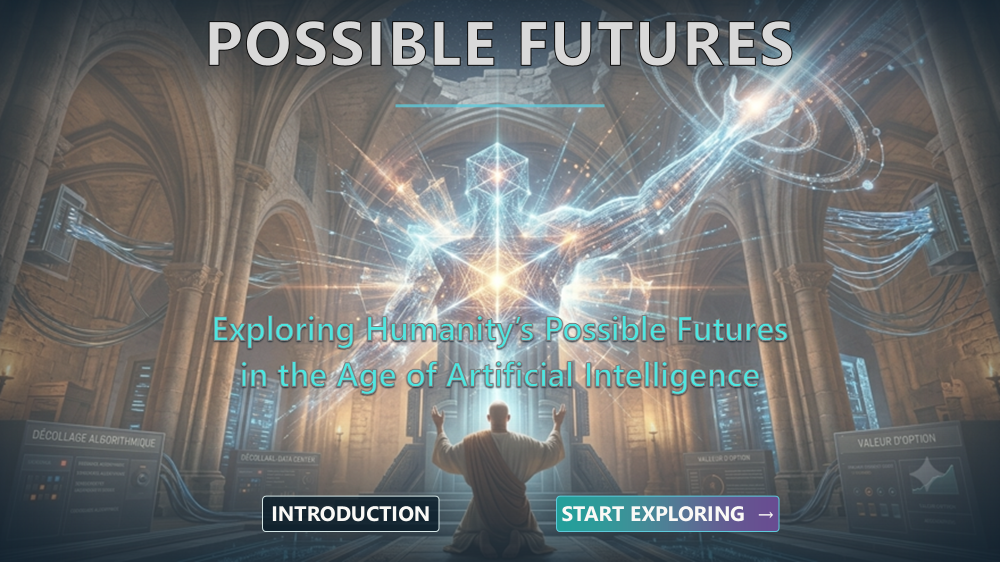

---
📥 **Download the interactive PDF:** 
➡️ https://github.com/PhilPF-2026/AI-Human-Possible-Futures/releases/latest 

---

# Possible Futures
**Exploring Humanity's Possible Futures in the Age of Artificial Intelligence.**

**=> What futures could AI create for humanity?**

This personal investigation explores hypothetical paths from extraordinary progress to dependency, concentrated power and loss of control.

It does not predict the future: it challenges assumptions and invites everyone into the conversation.

## Disclaimer

This work was produced in a personal capacity and reflects only the author's opinions, reflections and interpretations.

It does not represent the views, positions, strategies or policies of any employer, organization, customer, institution or partner.

## Security & Privacy
 
This document was designed to be fully self-contained. 
 
✅ No hyperlink inside the PDF redirects to an external website. 
 
✅ No personal data is collected. 
 
✅ No tracking, analytics or third-party services are embedded. 
 
✅ All navigation links remain internal to the document. 
 
**For security reasons, readers are encouraged to download the PDF directly from this GitHub repository and open it in their preferred PDF reader.**

## Latest Version

The latest version of the PDF can be downloaded directly from the Releases section of this repository.

## License

© 2026 Philippe Bellanger

This work may be shared in its original form provided that attribution is preserved and the content is not modified.

Creative Commons Attribution-NonCommercial-NoDerivatives 4.0 International (CC BY-NC-ND 4.0)

⚠️ GitHub displays PDFs in preview mode and does not support internal PDF navigation links.

For the full interactive experience, please download the PDF and open it in a PDF reader.
